# Taller-01 PHP PDO

1. clonar 
```
git clone https://github.com/jairoCO10/php-docker.git
```
2. levantar docker 
you have to have docker
```
docker compose up --build
```
3. configurar el Dbconection a conveniencia `api/settings/Dbconection.php`
```
private $host = "192.168.20.121"; //YOUR IP ADDRESS - dokcer ifconfig - xampp <localhost>.
private $dbname = "dbname"; // aquí debes reemplazar "dbname" con el nombre de tu base de datos
private $user = "root";
private $password = "test";
```
4. Cargar el `bdname.sql` en la base de datos, esta en la ruta `api/SQL/dbname.sql` 

5. Si usa xampp basta con arratrar la carpeta taller-01 al xampp para correrlo e importar la base de datos del punto 4.

---

## Pruebas de uso

1. GET PERSONAS
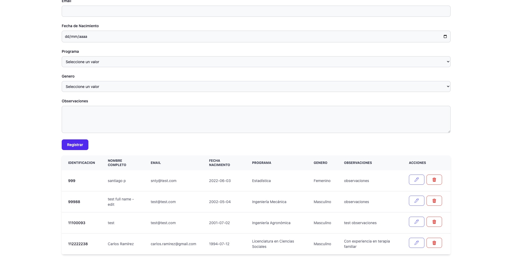

2. POST PERSONA
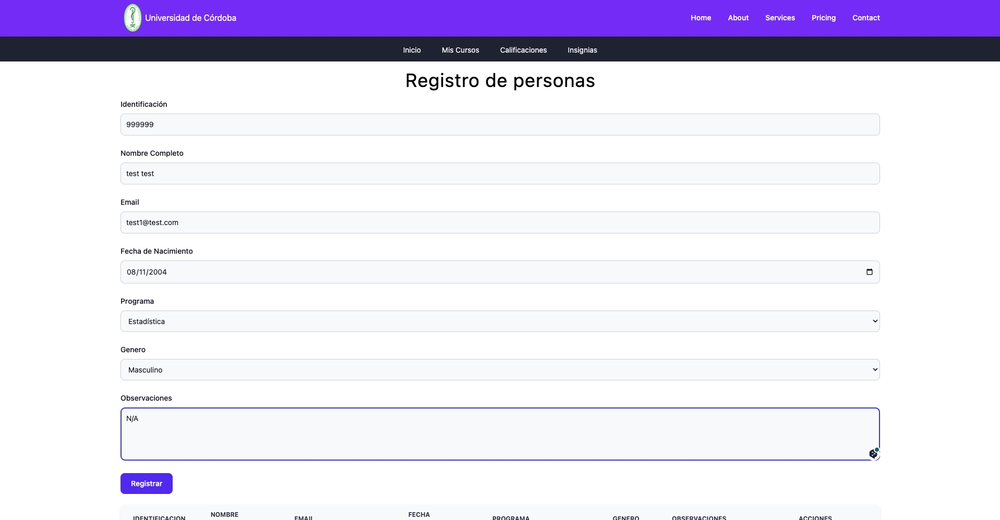
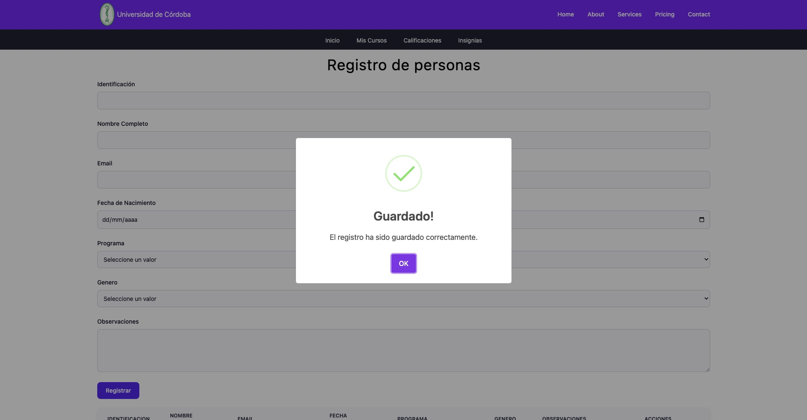
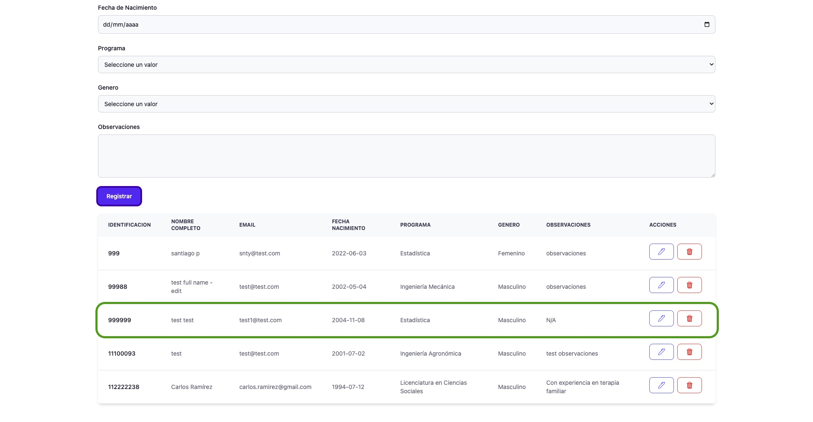

3. PUT PERSONA
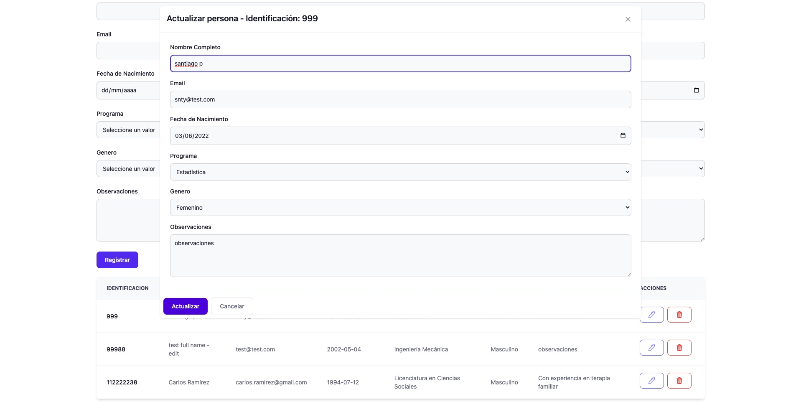
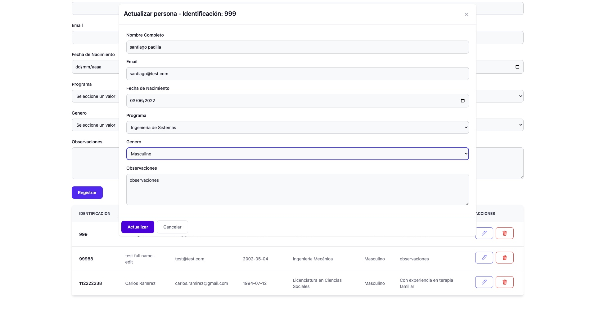
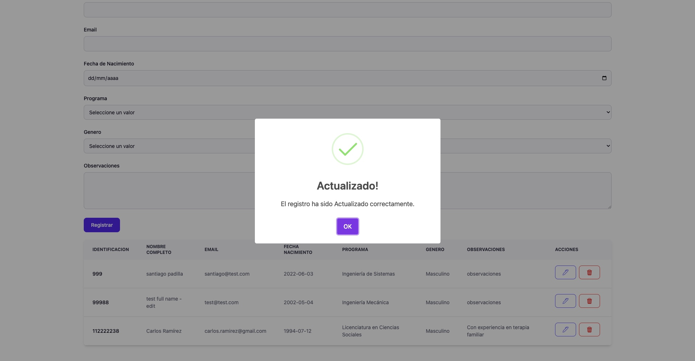
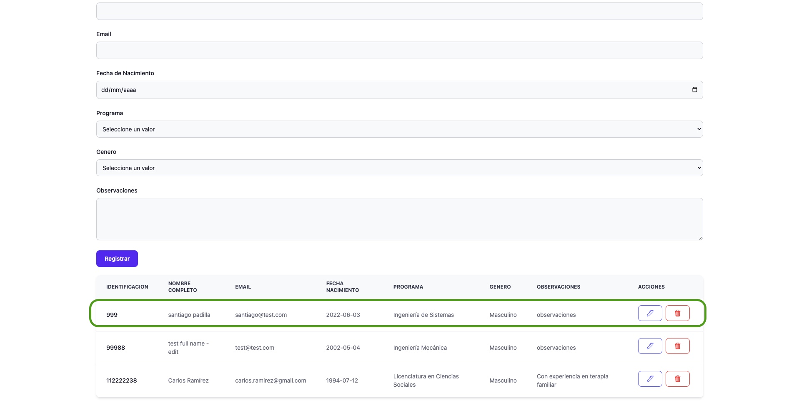


4. DELETE PERSONA
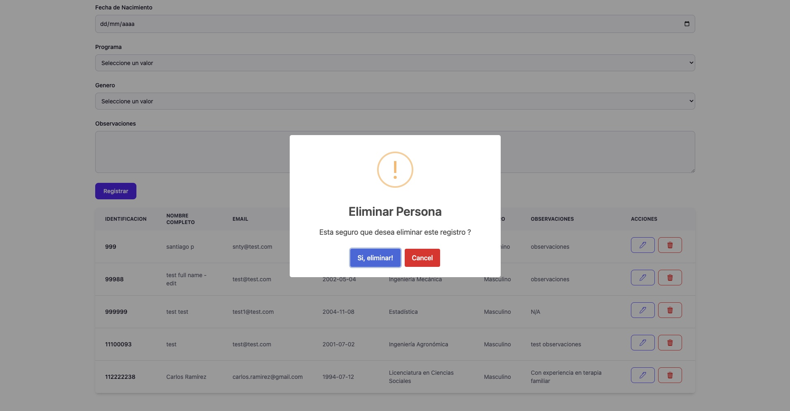
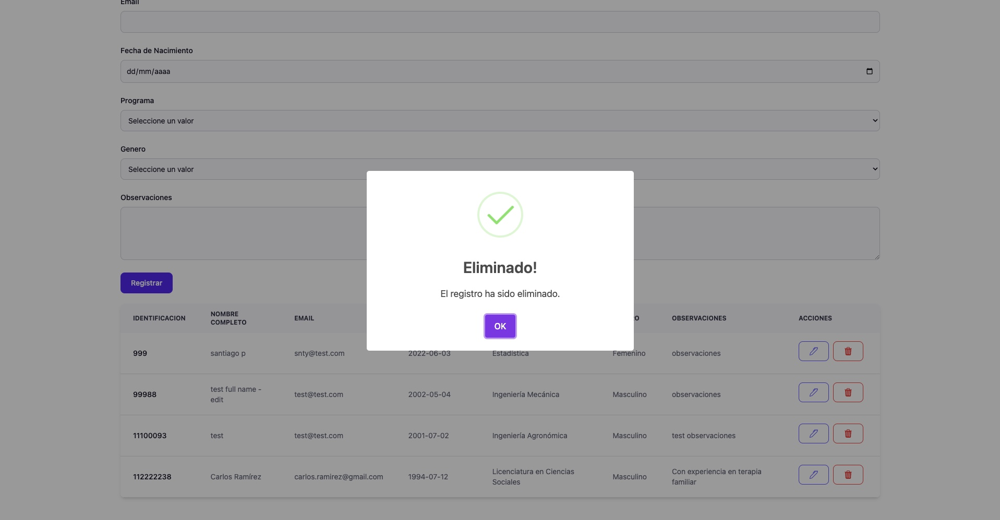


5. BASE DE DATOS
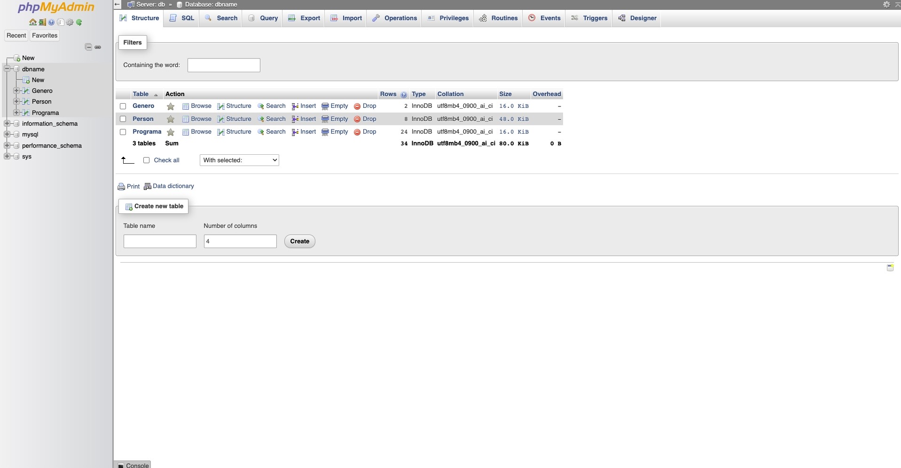
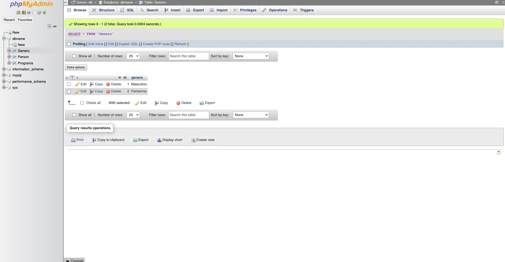
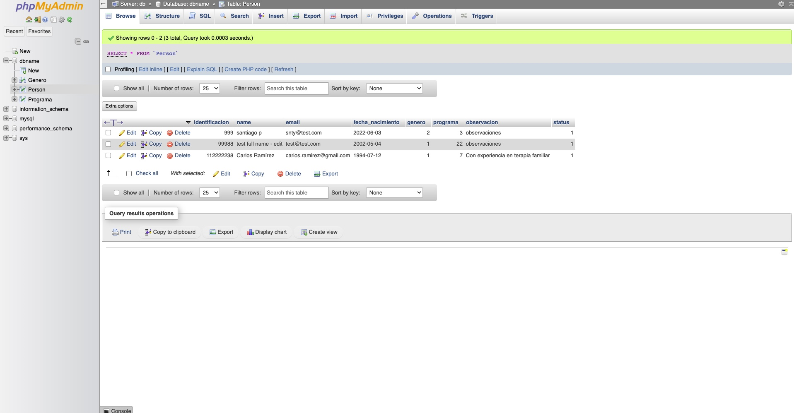
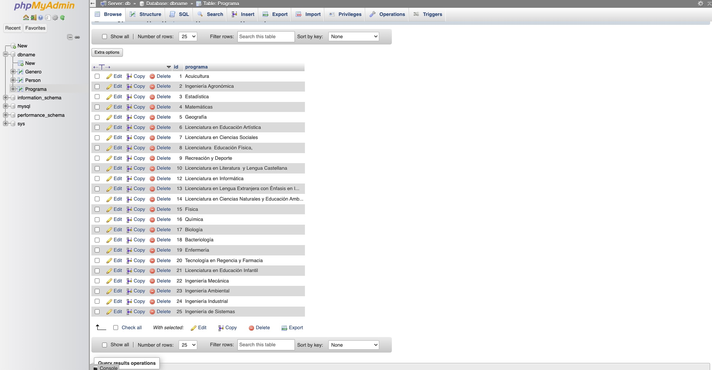

